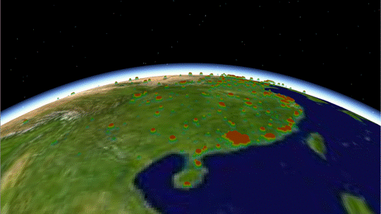
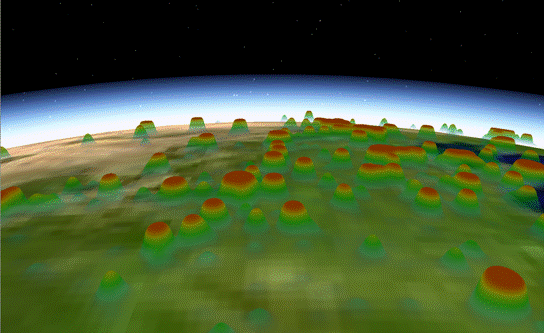

#热力图可视化
##系统配置要求:
- 操作系统: Windows XP SP3 或 Windows 7
- CPU: Intel Core2 双核 2.8GHZ或 AMD 双核 3.0GHZ 以上
- 显卡：Nvidia Quadro 600 或 Tesla 2050以上 CUDA核心不低于128个，CUDA版本4.0以上，显存2G以上
- 内存: 4G以上

 
##开发环境:
- 编程工具：VS 2008
- 三维图形库： OSG3.0.1及OSGEarth2.2
- 三维图形计算库：OSGCompute 1.1
- 着色语言：GLSL
- GPU编程语言：CUDA 5.0

 
##模块输入
三维热图输入数据为需要计算的热点数据。热点数据为float类型，以文本形式存储于.txt文件中，依次存入各个热点的经度lon、维度lat、热度夸张系数k以及高斯函数标准差s，各项数据间用空格隔开。

##实验数据
全国人口某一时刻上网行为的统计数据，数据规模为250万条，热图分辨率为2048*2048

##模块输出
 
 
 
